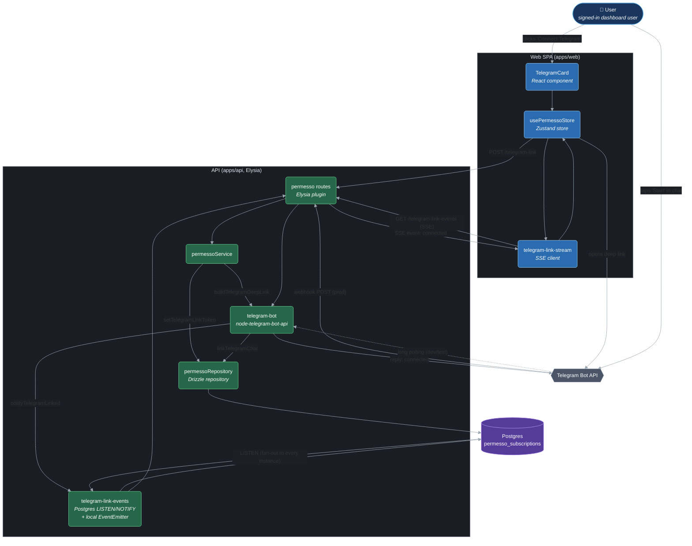
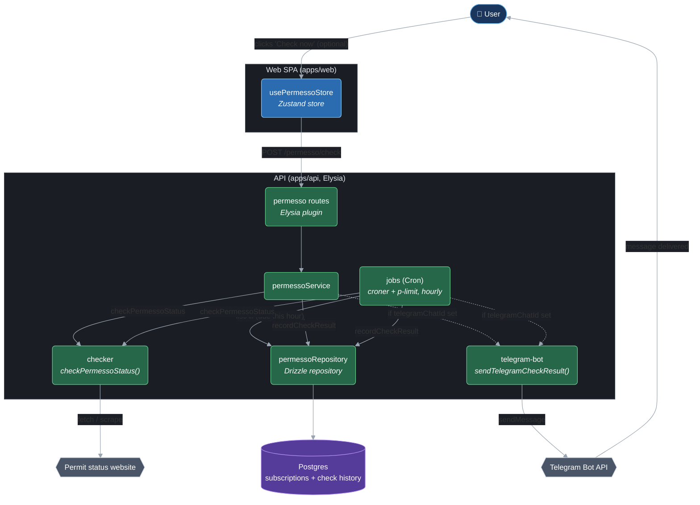

# Telegram Notifications — C4 Component Diagram

Scope: the Permesso Status feature's Telegram integration — linking a Telegram
account to a user, and delivering check-result notifications to it. Two
sub-flows are shown separately since they run on different triggers.

Diagrams below are C4 **component**-level (Person / Container / Component /
external System), drawn as Mermaid flowcharts rather than Mermaid's native
`C4Component` type — that renderer has poor contrast and messy auto-layout
once a diagram has more than a handful of nodes. Color key:

- 🟦 navy stadium — person (actor)
- 🔵 blue box — web (apps/web) component
- 🟢 green box — API (apps/api) component
- 🟣 purple cylinder — datastore
- ⬡ gray hexagon — external system

## Flow 1 — Account linking

## Flow 2 — Check-result notification

## Notes

- **Inbound updates run in dual mode**, decided once at startup by
  `NODE_ENV`: when `NODE_ENV=production`, `startTelegramBot()` registers a
  webhook via `bot.api.setWebhook()` (then confirms it with
  `getWebhookInfo()`) and Telegram pushes updates to `POST /telegram/webhook`,
  authenticated by the `X-Telegram-Bot-Api-Secret-Token` header matching
  `TELEGRAM_WEBHOOK_SECRET` (required in production). In development or test,
  it falls back to `bot.startPolling()` so contributors don't need a public
  tunnel to test the bot. Both paths converge on the same
  `bot.handleUpdate()` — the `/start <token>` handler logic is unchanged
  either way. A failure to register the webhook (bad URL, Telegram outage) is
  caught and logged rather than crashing the API's startup — the process
  boots with Telegram notifications disabled instead.
- **Linking** bridges the inbound update handler (webhook or polling) to the
  SSE route the browser is waiting on via Postgres `LISTEN`/`NOTIFY`
  (`telegram-link-events.ts`), not a bare in-process `EventEmitter`.
  `notifyTelegramLinked(userId)` runs `pg_notify('telegram_linked', userId)`;
  every API instance opens one `LISTEN telegram_linked` connection at startup
  (`startTelegramLinkListener()`, awaited before the server accepts
  requests) and re-emits locally to wake only the SSE requests it is holding
  open. This is what makes linking correct when the webhook request and the
  waiting SSE connection land on different replicas — the previous
  bare-`EventEmitter` version only worked within a single process.
- **Notifications** fire from two independent call paths — the manual
  `POST /permesso/check` route and the hourly `croner` job — both of which
  converge on the same `checker` → `repository` → `telegram-bot` sequence.
- If `TELEGRAM_BOT_TOKEN` is not configured, `telegram-bot.ts` no-ops: the
  bot never starts, deep links can't be built, and `sendTelegramCheckResult`
  is a silent no-op. If `API_URL` is public but `TELEGRAM_WEBHOOK_SECRET` is
  missing, the bot also refuses to start (it will not run an unauthenticated
  webhook), logging an error instead.
