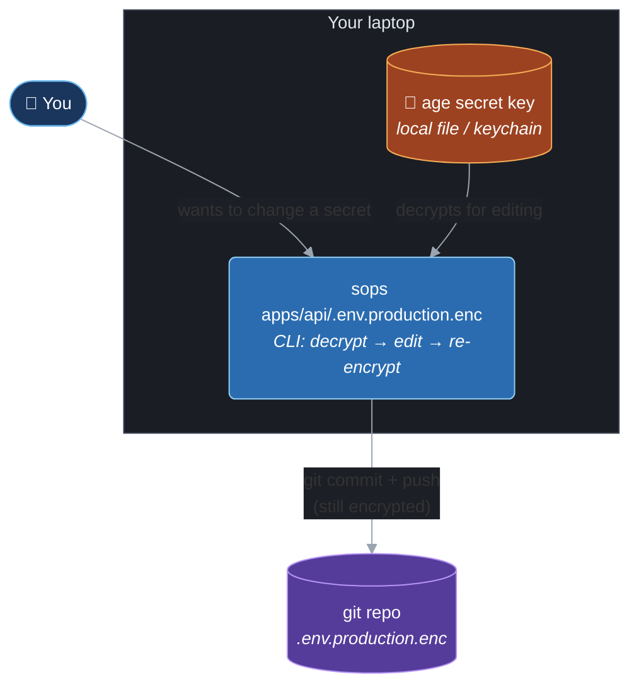
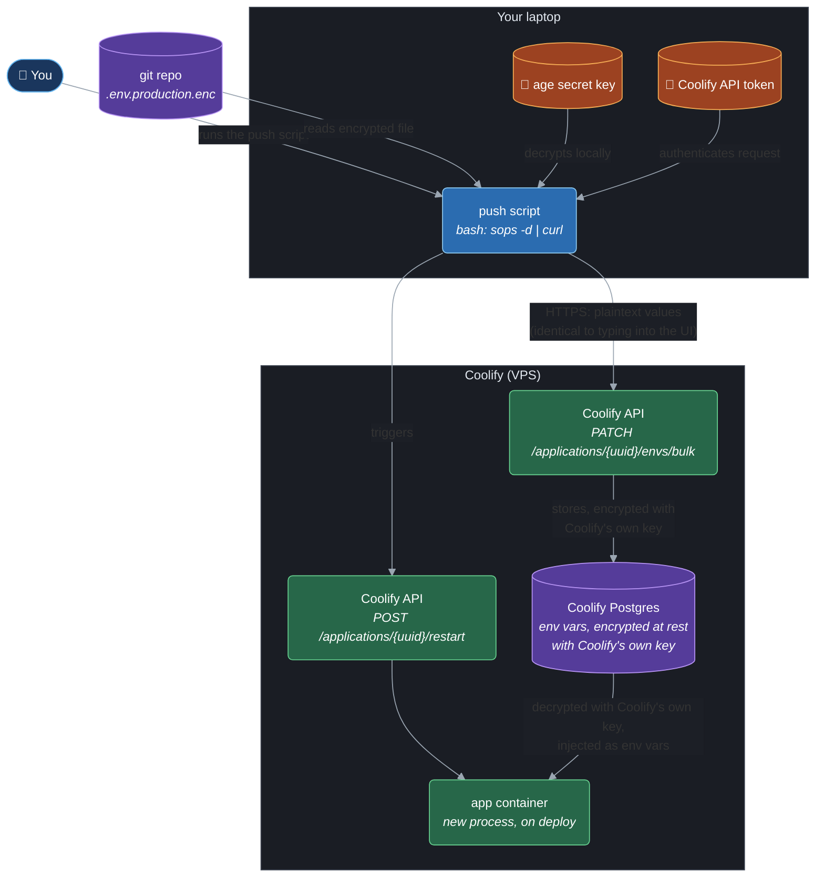

# Secrets flow: SOPS + age → Coolify

Local reference only — **not committed**.

Diagrams below are drawn in the same style as
`docs/architecture/telegram-notifications-c4-component.md` — Mermaid
flowcharts (not the native `C4Component` renderer), split into separate
flows per trigger. Color key:

- 🟦 navy stadium — person (you)
- 🔵 blue box — component on your laptop
- 🟢 green box — component on Coolify (the VPS)
- 🟣 purple cylinder — datastore (something at rest)
- 🟠 amber box — sensitive key material (never leaves your laptop)

## The pieces

- **`apps/api/.env.production.enc`** — prod secrets, encrypted with SOPS,
  committed to git. Safe to have in history since it's encrypted.
- **age keypair** — a public key (encrypts) and a secret key (decrypts).
  The secret key lives only on your laptop / password manager.
- **Coolify API token** — created once in Coolify's UI (Security → API
  Tokens). Authenticates the push script to Coolify's API.
- **Push script** — the only new automation: decrypts locally, sends
  plain values to Coolify.

## Flow 1 — Edit & commit a secret



## Flow 2 — Push to Coolify & deploy



## Script

```bash
#!/usr/bin/env bash
set -euo pipefail

UUID="your-app-uuid"                 # from Coolify UI URL or GET /applications
TOKEN="$COOLIFY_API_TOKEN"           # your own env/keychain, never committed
HOST="https://your-coolify-domain"

sops -d --output-type json apps/api/.env.production.enc \
  | jq '[to_entries[] | {key: .key, value: (.value|tostring), is_runtime: true, is_buildtime: false}]' \
  | jq '{data: .}' \
  | curl -s -X PATCH "$HOST/api/v1/applications/$UUID/envs/bulk" \
      -H "Authorization: Bearer $TOKEN" \
      -H "Content-Type: application/json" \
      -d @-

curl -s -X POST "$HOST/api/v1/applications/$UUID/restart" \
  -H "Authorization: Bearer $TOKEN"
```

## Notes

- **The age secret key and the Coolify API token both live only on your
  laptop.** Neither is ever sent to, or stored on, the VPS — Flow 2's
  laptop-side nodes are the only place either one is used.
- **Coolify's "encrypted at rest" step is unrelated to SOPS/age.** From
  Coolify's point of view, the plaintext values it receives from the push
  script are indistinguishable from values typed into its UI by hand — it
  encrypts them with its own key (Laravel `APP_KEY`), the same as it
  always has.
- **Updating stored values does not restart anything.** `PATCH
  .../envs/bulk` only changes what's stored; the separate `POST
  .../restart` call is what makes the new container actually pick up the
  changed values.
- **`VITE_API_URL` is a build-time arg**, not a runtime env var (see
  `docker-compose.prod.yml`, `web` service) — it needs `is_buildtime:
  true, is_runtime: false` when pushed. Everything else in that compose
  file is runtime-only.
